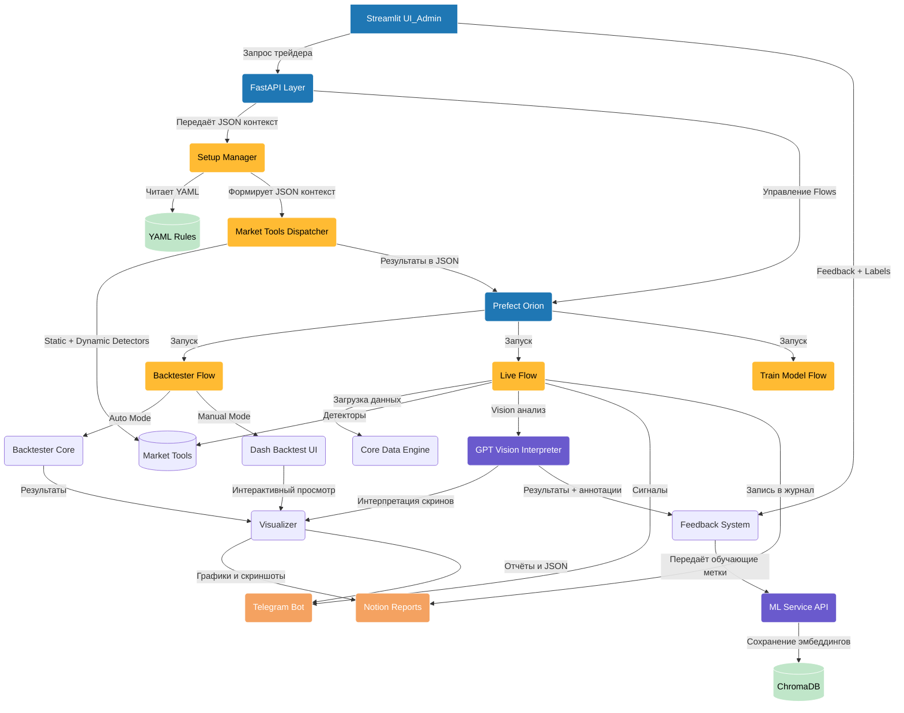

# ITA Project — Architecture Diagram (v1.1)

Графическая схема взаимодействия модулей проекта ITA в формате Mermaid.

```mermaid
graph TD
    %% UI Layer
    A1[Streamlit UI_Admin] -->|Запрос трейдера| B1(FastAPI Layer)
    A1 -->|Feedback + Labels| L1(Feedback System)

    %% API Layer
    B1 -->|Передаёт JSON контекст| C1(Setup Manager)
    B1 -->|Управление Flows| D1(Prefect Orion)

    %% Setup Manager and Market Tools
    C1 -->|Читает YAML| C2[(YAML Rules)]
    C1 -->|Формирует JSON контекст| E1(Market Tools Dispatcher)
    E1 -->|Static + Dynamic Detectors| E2[(Market Tools)]
    E1 -->|Результаты в JSON| D1

    %% Prefect Flows
    D1 -->|Запуск| F1(Backtester Flow)
    D1 -->|Запуск| F2(Live Flow)
    D1 -->|Запуск| F3(Train Model Flow)

    %% Backtester Flow
    F1 -->|Auto Mode| G1(Backtester Core)
    F1 -->|Manual Mode| G2(Dash Backtest UI)
    G1 -->|Результаты| H1(Visualizer)
    G2 -->|Интерактивный просмотр| H1

    %% Live Flow
    F2 -->|Загрузка данных| I1(Core Data Engine)
    F2 -->|Детекторы| E2
    F2 -->|Vision анализ| J1(GPT Vision Interpreter)
    F2 -->|Сигналы| K1(Telegram Bot)
    F2 -->|Запись в журнал| M1(Notion Reports)

    %% Learning and Vision
    J1 -->|Интерпретация скринов| H1
    J1 -->|Результаты + аннотации| L1
    L1 -->|Передаёт обучающие метки| N1(ML Service API)
    N1 -->|Сохранение эмбеддингов| N2[(ChromaDB)]

    %% Integrations
    H1 -->|Графики и скриншоты| M1
    H1 -->|Отчёты и JSON| K1

    %% Styles
    classDef main fill:#1f77b4,stroke:#fff,color:#fff;
    classDef data fill:#ffbb33,stroke:#fff,color:#000;
    classDef ai fill:#6a5acd,stroke:#fff,color:#fff;
    classDef store fill:#c0e6c9,stroke:#fff,color:#000;
    classDef integ fill:#f4a261,stroke:#fff,color:#fff;

    class A1,B1,D1 main;
    class C1,E1,F1,F2,F3 data;
    class J1,N1 ai;
    class M1,K1 integ;
    class N2,C2 store;
```
